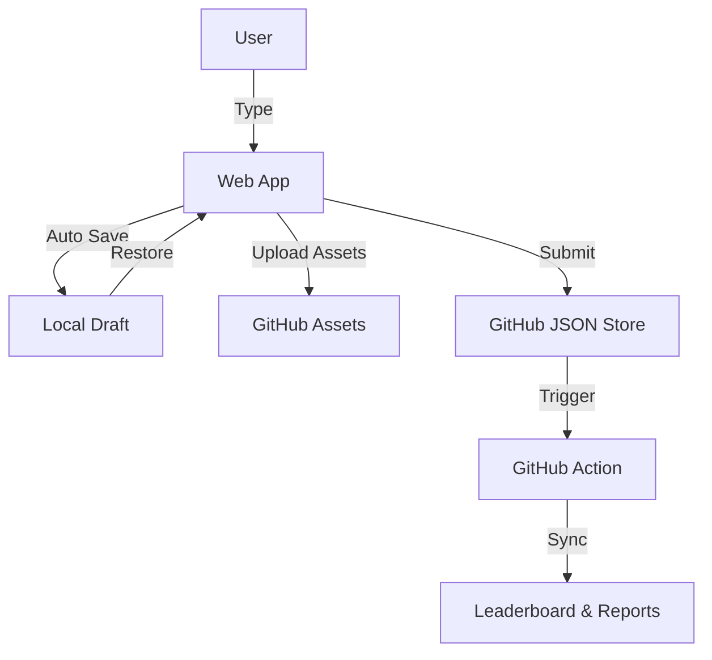

# GitHub Study OS V4 - Persistence Edition

An advanced learning tracking platform built entirely on top of GitHub, featuring draft persistence and offline resilience.

## 🌟 Version 4 Features

- **Draft Persistence**: Never lose your work. Drafts are automatically saved to local storage.
- **Auto-Save**: Changes are saved every second (debounced).
- **Offline Mode**: Continue writing drafts and attaching assets even when offline.
- **Resilient Editing**: Session recovery ensures you pick up exactly where you left off.
- **Draft Indicators**: Visual feedback for save status.

## 🏗 System Architecture



## 💾 Draft System

The draft system uses a custom React hook `useLocalDraft` to manage state synchronization with `localStorage`.

### Key: `study-checkin-draft`

Structure:
```json
{
  "title": "Learning Rust",
  "category": "Backend",
  "tags": ["rust", "memory-safety"],
  "content_md": "...",
  "assets": ["..."],
  "timestamp": "2024-03-16T10:00:00Z"
}
```

### Behavior
1.  **Auto Save**: Triggers 1s after last keystroke.
2.  **Recovery**: On page load, checks for existing draft and restores UI.
3.  **Reset**: Clears draft only after successful GitHub submission.

## 🔌 Offline Capability

- **Writing**: Full rich text editing works offline.
- **Assets**: Images attached while offline are stored as Base64 data URIs in the draft content, allowing immediate preview.
- **Submission**: Requires online connection.

## 🎨 Theme System

The system uses Tailwind CSS and CSS variables for theming.
Themes are defined in `src/context/ThemeContext.tsx` and applied via `data-theme` attribute.

- **Solana**: `#9945FF` (Purple) & `#14F195` (Green)
- **Cyberpunk**: `#00F0FF` (Cyan) & `#FF003C` (Pink) & `#FTEE0E` (Yellow)

## 🚀 Getting Started

1.  Clone repository.
2.  `cd web`
3.  `npm install`
4.  `npm run dev`

## 🛠 Tech Stack

- **Frontend**: React, Vite, TailwindCSS, TipTap
- **Backend**: GitHub API, GitHub Actions
- **Persistence**: LocalStorage, GitHub Repo
